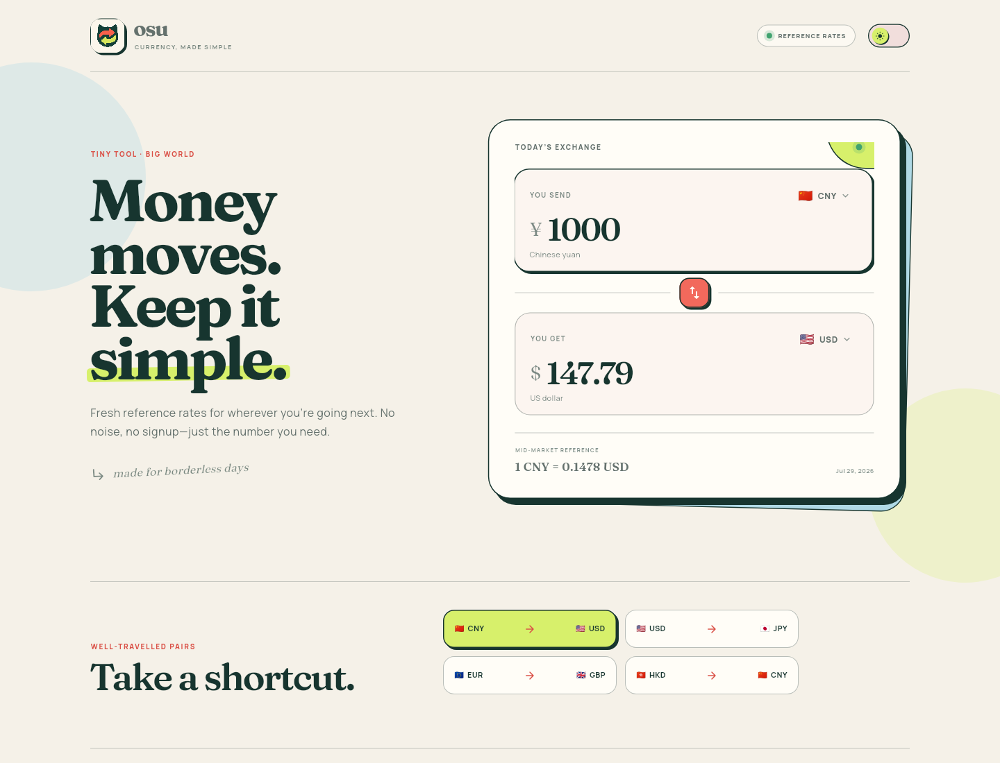
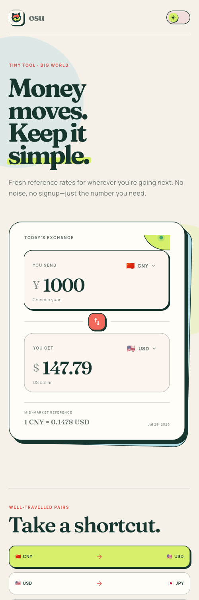

# osu

**Currency, made simple.**

osu is a modern Flutter currency converter with a warm Mimi-inspired visual
system, fast two-way conversion, and resilient reference-rate caching.



<p align="center">
  
</p>

## Highlights

- Modern Flutter 3 / Dart 3 project for Android, iOS, and Web
- Two-way amount editing with instant currency swapping
- 24 searchable currencies and quick travel pairs
- HTTPS reference rates from [Frankfurter](https://frankfurter.dev/)
- 24-hour local cache with clear offline fallback messaging
- Responsive Mimi-inspired UI with light and dark themes
- Original cat-ear exchange logo and generated launcher icons
- Unit, repository, and widget test coverage

## Run

```bash
flutter pub get
flutter run
```

Choose an Android, iOS, Chrome, or web-server target supported by your local
Flutter installation.

## Verify

```bash
flutter analyze
flutter test
flutter build web --release
```

To regenerate platform icons after changing the logo:

```bash
dart run flutter_launcher_icons
```

Exchange rates are reference data and should not be treated as executable
trading quotes.

## Project structure

```text
lib/
├── data/       # Supported currencies and quick pairs
├── models/     # Currency and rate value objects
├── pages/      # Responsive converter experience
├── services/   # HTTPS rate repository and local cache
├── theme/      # Light/dark Mimi design system
├── utils/      # Parsing and money formatting
└── widgets/    # Reusable brand, input, picker, and toggle widgets
```

MIT © Gavin Phang
