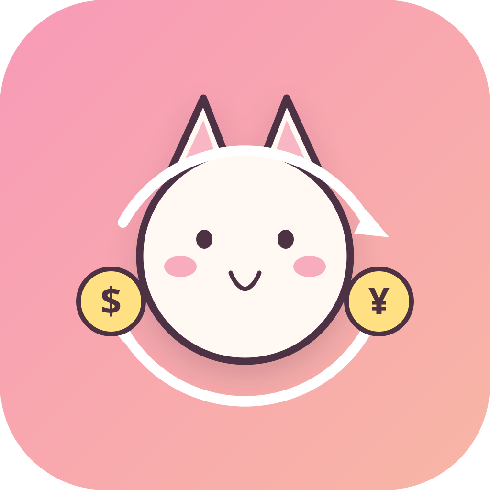
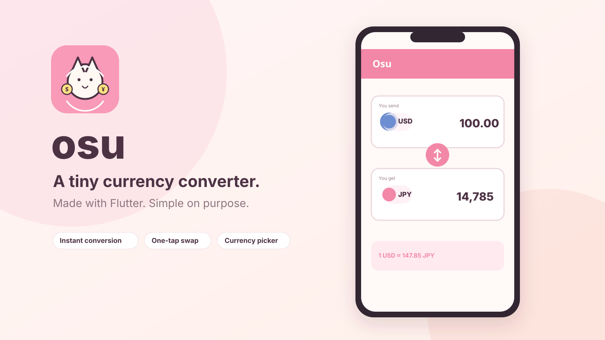
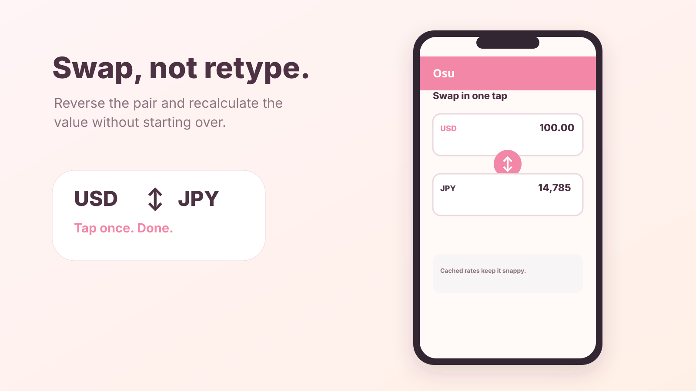
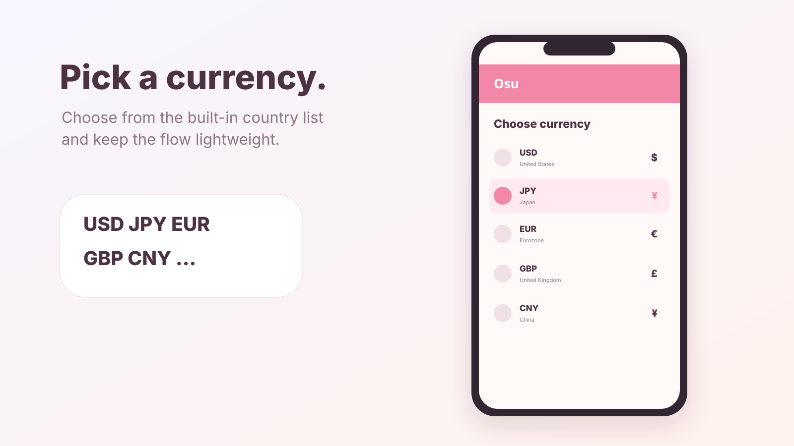

  

<h1 align="center">osu</h1>

A tiny currency converter built with Flutter.

  

## Tiny by design

- Convert between currencies as you type.
- Swap the pair in one tap.
- Pick a currency from the built-in country list.
- Cache fetched rates during the session.

  
  

## About

A small Flutter project from 2019. The code is intentionally left close to its original shape; the icon and project presentation got a fresh coat of paint.

MIT licensed.
