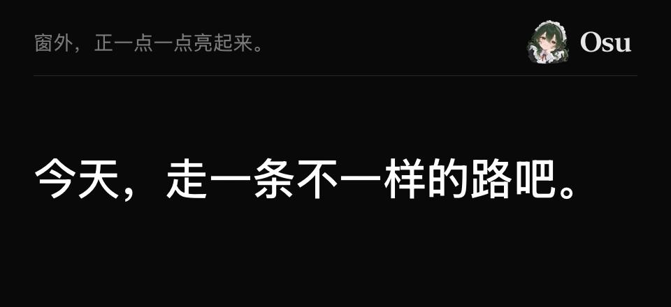

  
  <h1>Osu</h1>
  
Floating translated subtitles for iPhone.

  

    <a href="README_ZH.md">简体中文</a>
    · <a href="CONTRIBUTING.md">Build from source</a>
    · <a href="docs/acceptance/2026-09-20.md">Test status</a>
  

Osu transcribes and translates audio from other iPhone apps, then displays the captions in a Picture in Picture window. It is inspired by the desktop app [Mimi](https://github.com/yuxino/mimi).

**Preview · iOS 18+ · Install from source.** No App Store or TestFlight release yet.

*Caption style with illustrative text.*

## Features

- **Lyrics-style captions** — cloud translations move up sentence by sentence, with the current line prominent and the previous line faded. Translations appear alone by default; toggle the original text from home or settings.
- **Automatic language detection** — Alibaba mode detects the spoken language and translates into Chinese by default. Change either language when needed.
- **Local or cloud** — choose Apple on-device recognition and translation, or Alibaba Cloud realtime translation. Apple translation requires iOS 26 and supported language packs; local recognition requires a manually selected source language.

## Get started

1. [Build and install](CONTRIBUTING.md), then add your Alibaba Cloud Model Studio API key for the Beijing region when prompted, or choose Apple local mode in settings.
2. Tap **开始听** to open the system broadcast panel directly. Select **Osu Audio** and confirm **开始广播**.
3. Return to your video app. Close the subtitle window or tap **停止** to stop listening.

Keep the video in its original app: another app's Picture in Picture window can replace Osu's subtitles and end capture. Close iPhone Mirroring before starting a broadcast. App compatibility and long background sessions are still being tested.

## Privacy

Osu does not save audio or subtitles; video and microphone samples are discarded. Apple mode processes audio locally. Alibaba mode sends app audio to the provider and may incur usage charges; API keys stay in iOS Keychain.

## Development

React Native, TypeScript, and native iOS audio capture. See [building and checks](CONTRIBUTING.md), the [Alibaba guide](docs/alibaba.md), and [language support and diagnostics](docs/languages-and-diagnostics.md).

[MIT](LICENSE)

## Dynamic Island mode (experimental)

The home screen now offers Picture in Picture and Dynamic Island. The new mode currently supports Alibaba only: a short translation in the compact island, the current sentence when expanded, and a Lock Screen Live Activity. Choose whether to show the original text before starting. Devices without Dynamic Island get the Lock Screen presentation; Apple local mode continues to use PiP.

Expansion and refresh timing are controlled by iOS; long sentences may be truncated. Current subtitles are handed to the system Live Activity and removed when the session stops. Continuous updates from the independent broadcast process still require physical-device acceptance. The synthetic audio tests in Settings continue to use the original PiP path.
