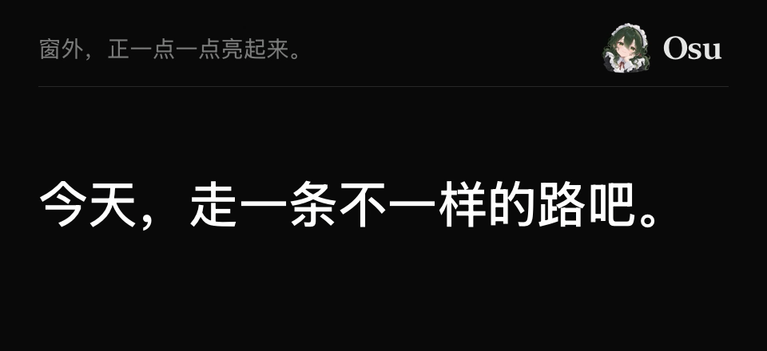

<div align="center">
  
  <h1>Osu</h1>
  <p>Floating translated subtitles for iPhone.</p>
  <p>
    <a href="README_ZH.md">简体中文</a>
    · <a href="CONTRIBUTING.md">Build from source</a>
  </p>
</div>

Osu transcribes and translates audio from other iPhone apps, then displays the captions in a Picture in Picture window. It is inspired by the desktop app [Mimi](https://github.com/yuxino/mimi).

**iOS 18+ · Open source · Build and install with Xcode.**



*Caption style with illustrative text.*

## Features

- **Lyrics-style captions** — cloud translations move up sentence by sentence, with the current line prominent and the previous line faded. Translations appear alone by default; toggle the original text from home or settings.
- **Automatic language detection** — Alibaba mode detects the spoken language and translates into Chinese by default. Change either language when needed.
- **Local or cloud** — choose Apple on-device recognition and translation, or Alibaba Cloud realtime translation. Apple translation requires iOS 26 and supported language packs; local recognition requires a manually selected source language.

## Install from source

Osu is currently distributed as source code. Download it from this repository, build it on a Mac, and install it on your iPhone with Xcode.

You need **macOS, Xcode, Node.js 22.13+, Ruby/Bundler, an Apple signing team, and an iPhone running iOS 18 or later**.

```sh
git clone https://github.com/yuxino/osu.git
cd osu
npm ci
bundle install
npm run ios:prebuild
npm run ios:configure
cd ios
bundle exec pod install
cd ..
npm run ios:device
```

For the first installation, open the generated `.xcworkspace` in `ios/` with Xcode. Select your signing team for the app, **Osu Audio** broadcast extension, and **OsuSubtitles** widget extension, then connect and select your iPhone. The Release build bundles its JavaScript and runs without a development server. See [the build guide](CONTRIBUTING.md) for native-project details.

## Get started

1. [Build and install](CONTRIBUTING.md), then add your Alibaba Cloud Model Studio API key for the Beijing region when prompted, or choose Apple local mode in settings.
2. Tap **开始听** to open the system broadcast panel directly. Select **Osu Audio** and confirm **开始广播**.
3. Return to your video app. Tap **停止** in Osu to stop listening.

Keep the video in its original app. If another app's Picture in Picture window takes over the caption window, capture and translation continue and the caption window returns automatically once the other window closes. Close iPhone Mirroring before starting a broadcast.

## Privacy

Osu does not save audio or subtitles; video and microphone samples are discarded. Apple mode processes audio locally. Alibaba mode sends app audio to the provider and may incur usage charges; API keys stay in iOS Keychain.

## Development

React Native, TypeScript, and native iOS audio capture. See [building and checks](CONTRIBUTING.md), the [Alibaba guide](docs/alibaba.md), and [language support and diagnostics](docs/languages-and-diagnostics.md).

[MIT](LICENSE)

## Dynamic Island (retired)

The independent Dynamic Island subtitle mode was retired: iOS requires a foreground process to start a Live Activity, which the broadcast process can never be, and the extension cannot see the app-created activity either. Both failures are device-confirmed; see the [retirement report](docs/dynamic-island-retirement.md). Reviving the mode requires an APNs-based backend.
